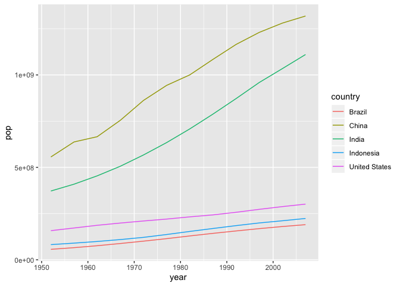

## Instructions
Answer the following questions and complete the exercises in RMarkdown. Please embed all of your code and push your final work to your repository. Your final lab report should be organized, clean, and run free from errors. Remember, you must remove the `#` for any included code chunks to run.  

## Libraries

```r
library(tidyverse)
```

## Resources
The idea for this assignment came from [Rebecca Barter's](http://www.rebeccabarter.com/blog/2017-11-17-ggplot2_tutorial/) ggplot tutorial so if you get stuck this is a good place to have a look.  

## Gapminder
For this assignment, we are going to use the dataset [gapminder](https://cran.r-project.org/web/packages/gapminder/index.html). Gapminder includes information about economics, population, and life expectancy from countries all over the world. You will need to install it before use. This is the same data that we used for the practice midterm. You may want to load that assignment for reference.  

```r
#install.packages("gapminder")
library("gapminder")
```

## Questions
The questions below are open-ended and have many possible solutions. Your approach should, where appropriate, include numerical summaries and visuals. Be creative; assume you are building an analysis that you would ultimately present to an audience of stakeholders. Feel free to try out different `geoms` if they more clearly present your results.  

**1. Use the function(s) of your choice to get an idea of the overall structure of the data frame, including its dimensions, column names, variable classes, etc. As part of this, determine how NAs are treated in the data.**  

```r
glimpse(gapminder)
```

```
## Observations: 1,704
## Variables: 6
## $ country   <fct> Afghanistan, Afghanistan, Afghanistan, Afghanistan, Afghani<U+2026>
## $ continent <fct> Asia, Asia, Asia, Asia, Asia, Asia, Asia, Asia, Asia, Asia,<U+2026>
## $ year      <int> 1952, 1957, 1962, 1967, 1972, 1977, 1982, 1987, 1992, 1997,<U+2026>
## $ lifeExp   <dbl> 28.801, 30.332, 31.997, 34.020, 36.088, 38.438, 39.854, 40.<U+2026>
## $ pop       <int> 8425333, 9240934, 10267083, 11537966, 13079460, 14880372, 1<U+2026>
## $ gdpPercap <dbl> 779.4453, 820.8530, 853.1007, 836.1971, 739.9811, 786.1134,<U+2026>
```


```r
dim(gapminder)
```

```
## [1] 1704    6
```


```r
names(gapminder)
```

```
## [1] "country"   "continent" "year"      "lifeExp"   "pop"       "gdpPercap"
```


```r
library(naniar)
```


```r
naniar::miss_var_summary(gapminder)
```

```
## # A tibble: 6 x 3
##   variable  n_miss pct_miss
##   <chr>      <int>    <dbl>
## 1 country        0        0
## 2 continent      0        0
## 3 year           0        0
## 4 lifeExp        0        0
## 5 pop            0        0
## 6 gdpPercap      0        0
```


```r
summary(gapminder)
```

```
##         country        continent        year         lifeExp     
##  Afghanistan:  12   Africa  :624   Min.   :1952   Min.   :23.60  
##  Albania    :  12   Americas:300   1st Qu.:1966   1st Qu.:48.20  
##  Algeria    :  12   Asia    :396   Median :1980   Median :60.71  
##  Angola     :  12   Europe  :360   Mean   :1980   Mean   :59.47  
##  Argentina  :  12   Oceania : 24   3rd Qu.:1993   3rd Qu.:70.85  
##  Australia  :  12                  Max.   :2007   Max.   :82.60  
##  (Other)    :1632                                                
##       pop              gdpPercap       
##  Min.   :6.001e+04   Min.   :   241.2  
##  1st Qu.:2.794e+06   1st Qu.:  1202.1  
##  Median :7.024e+06   Median :  3531.8  
##  Mean   :2.960e+07   Mean   :  7215.3  
##  3rd Qu.:1.959e+07   3rd Qu.:  9325.5  
##  Max.   :1.319e+09   Max.   :113523.1  
## 
```


**2. Among the interesting variables in gapminder is life expectancy. How has global life expectancy changed between 1952 and 2007?**


```r
#mean life expectancy between 1952 and 2007
gapminder %>%
  group_by(year) %>%
  summarize(m = mean(lifeExp))
```

```
## # A tibble: 12 x 2
##     year     m
##    <int> <dbl>
##  1  1952  49.1
##  2  1957  51.5
##  3  1962  53.6
##  4  1967  55.7
##  5  1972  57.6
##  6  1977  59.6
##  7  1982  61.5
##  8  1987  63.2
##  9  1992  64.2
## 10  1997  65.0
## 11  2002  65.7
## 12  2007  67.0
```


**3. How do the distributions of life expectancy compare for the years 1952 and 2007? _Challenge: Can you put both distributions on a single plot?_**

```r
gap_life_1952 <- gapminder %>%
  filter(year == 1952)
gap_life_2007 <- gapminder %>%
  filter(year == 2007)
ggplot(gapminder, aes(x = lifeExp)) +
  geom_histogram(data = gap_life_1952, alpha = 0.6, color = "black")+
  geom_histogram(data = gap_life_2007, alpha = 0.6, color = "blue", fill = "light blue")+
  labs(title = "Distribution of Life Expectancy")
```

```
## `stat_bin()` using `bins = 30`. Pick better value with `binwidth`.
## `stat_bin()` using `bins = 30`. Pick better value with `binwidth`.
```

<!-- -->


**4. Your answer above doesn't tell the whole story since life expectancy varies by region. Make a summary that shows the min, mean, and max life expectancy by continent for all years represented in the data.**


```r
gapminder %>%
  group_by(continent) %>%       #add year here if you want to look at more data
  summarize(min_life = min(lifeExp),
            max_life = max(lifeExp),
            mean_life = mean(lifeExp))
```

```
## # A tibble: 5 x 4
##   continent min_life max_life mean_life
##   <fct>        <dbl>    <dbl>     <dbl>
## 1 Africa        23.6     76.4      48.9
## 2 Americas      37.6     80.7      64.7
## 3 Asia          28.8     82.6      60.1
## 4 Europe        43.6     81.8      71.9
## 5 Oceania       69.1     81.2      74.3
```


**5. How has life expectancy changed between 1952-2007 for each continent? Try using `geom_line()` for this, including all continents on the same  plot.**


```r
gapminder %>%
  select(year, continent, lifeExp) %>%
  group_by(continent, year) %>%
  summarize(mean_life_exp = mean(lifeExp)) %>%
  ggplot(aes(x = year, y = mean_life_exp, group = continent, shape = continent, color = continent)) +
  geom_line()
```

<!-- -->
+ This is beautiful now, thanks Dawson

**6. We are interested in the relationship between per capita GDP and life expectancy; i.e. does having more money help you live longer?**

```r
#x = GDP, y = life expectancy   
gapminder %>%
  ggplot(aes(x=gdpPercap, y = lifeExp)) +
  geom_jitter()
```

<!-- -->


**7. There is extreme disparity in per capita GDP. Rescale the x axis to make this easier to interpret. How would you characterize the relationship?**

```r
gapminder %>%
  filter(gdpPercap < 35000) %>%
  ggplot(aes(x=gdpPercap, y = lifeExp)) +
  geom_jitter()
```

<!-- -->
+ This is a logarithmic relationship

**8. Which countries have had the largest population growth since 1952?**

```r
pop_growth_gapminder <-
  gapminder %>%
  group_by(country) %>%
  summarize(min_pop = min(pop),
            max_pop = max(pop)) %>%
  mutate(range_pop = max_pop-min_pop) %>%
  arrange(desc(range_pop)) %>%
  head(5)
pop_growth_gapminder
```

```
## # A tibble: 5 x 4
##   country         min_pop    max_pop range_pop
##   <fct>             <int>      <int>     <int>
## 1 China         556263527 1318683096 762419569
## 2 India         372000000 1110396331 738396331
## 3 United States 157553000  301139947 143586947
## 4 Indonesia      82052000  223547000 141495000
## 5 Brazil         56602560  190010647 133408087
```


**9. Use your results from the question above to plot population growth for the top five countries since 1952.**


```r
pop_growth_gapminder %>%
  ggplot(aes(x=country, y = range_pop, fill = country)) +
  geom_col()
```

<!-- -->


**10. How does per capita GDP growth compare between these same five countries?**


```r
gdp_top_five_growth <- gapminder %>%
  filter(country == "Brazil" |
           country == "China" |
           country == "India" |
           country == "Indonesia" |
           country == "United States") %>%
  group_by(country) %>%
  summarize(min_gdp = min(gdpPercap),
            max_gdp = max(gdpPercap)) %>%
  mutate(range_gdp = max_gdp - min_gdp) %>%
  arrange(desc(range_gdp))
gdp_top_five_growth
```

```
## # A tibble: 5 x 4
##   country       min_gdp max_gdp range_gdp
##   <fct>           <dbl>   <dbl>     <dbl>
## 1 United States  13990.  42952.    28961.
## 2 Brazil          2109.   9066.     6957.
## 3 China            400.   4959.     4559.
## 4 Indonesia        750.   3541.     2791.
## 5 India            547.   2452.     1906.
```


```r
gdp_top_five_growth %>%
  ggplot(aes(x=country, y = range_gdp, fill = country)) +
  geom_col()
```

<!-- -->


```r
gapminder %>%
    filter(country == "Brazil" |
           country == "China" |
           country == "India" |
           country == "Indonesia" |
           country == "United States") %>%
  ggplot(aes(x = year, y = pop, color = country)) +
  geom_line()
```

<!-- -->


## Push your final code to GitHub!
Please be sure that you check the `keep md` file in the knit preferences. 
